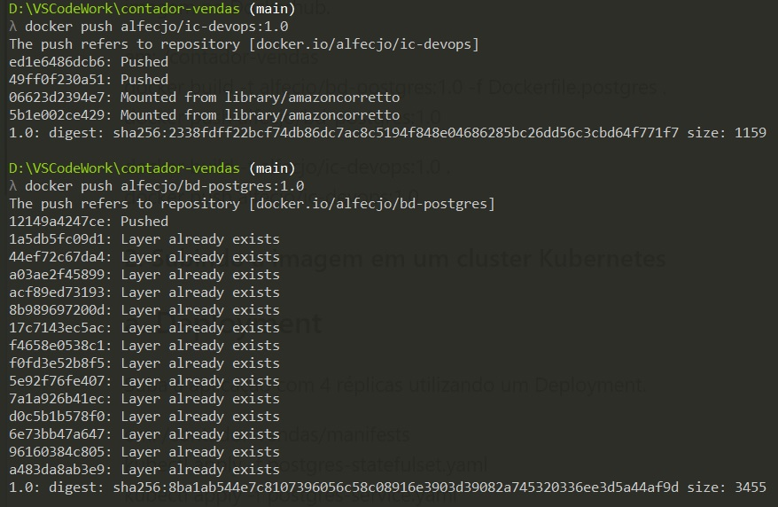
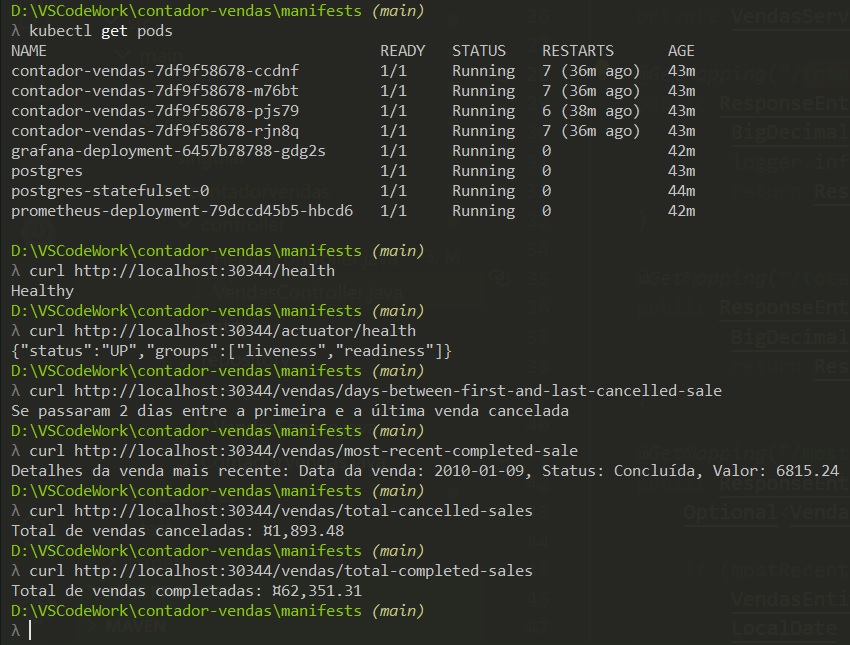
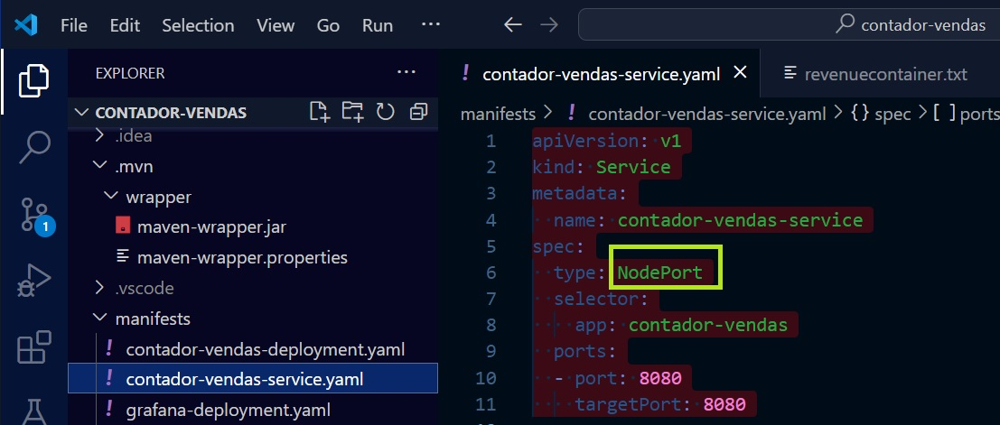
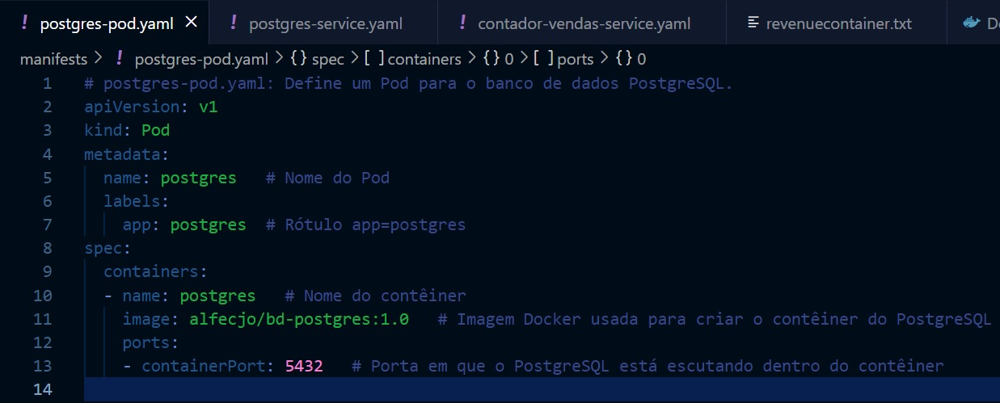
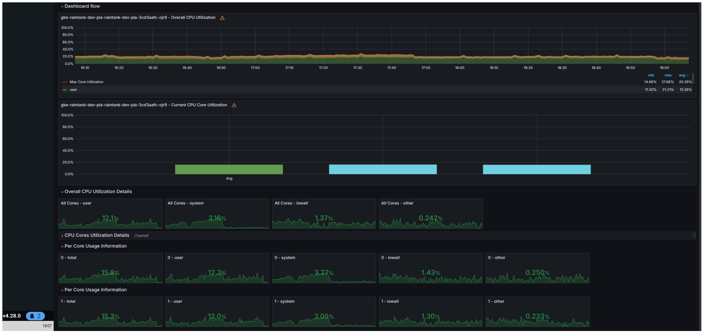

### Ao Instituto Infnet - Prof. Leonardo Glória.. (2024-04-14)
### Trabalho da disciplina: Integração Contínua e DevOps 

### 1. Criação e publicação da imagem Docker
Utilize o Docker para criar uma imagem personalizada de alguma aplicação previamente construída e publique a imagem no Dockerhub.

em: /contador-vendas 
docker build -t alfecjo/bd-postgres:1.0 -f Dockerfile.postgres . 
docker push alfecjo/bd-postgres:1.0 

docker build -t alfecjo/ic-devops:1.0 . 
docker push alfecjo/ic-devops:1.0 

### 2. Subindo a imagem em um cluster Kubernetes
## a. Deployment
Suba a aplicação com 4 réplicas utilizando um Deployment.

em: /contador-vendas/manifests 
kubectl apply -f postgres-statefulset.yaml 
kubectl apply -f postgres-service.yaml 
kubectl apply -f postgres-pod.yaml 
kubectl apply -f contador-vendas-deployment.yaml 
kubectl apply -f contador-vendas-service.yaml 
kubectl apply -f prometheus-pvc.yaml 
kubectl apply -f prometheus-deployment.yaml 
kubectl apply -f prometheus-service.yaml 
kubectl apply -f grafana-pvc.yaml 
kubectl apply -f grafana-deployment.yaml 
kubectl apply -f grafana-service.yaml 

## b. Expondo a aplicação
Exponha a aplicação de forma que fique acessível fora do cluster usando NodePort.

em: /contador-vendas/manifests 
contador-vendas-service.yaml 

## c. Configuração do banco de dados
Para aplicações que fazem uso de banco de dados, crie um POD com o mesmo e deixe acessível através do ClusterIP.

em: /contador-vendas/manifests 
postgres-statefulSet.yaml 
postgres-service.yaml 
#### Por estar definindo diretamente um Pod (kind: Pod) para o banco de dados PostgreSQL. Este Pod será acessível apenas internamente dentro do cluster Kubernetes e não precisará de um ClusterIP para expor o serviço. 
postgres-pod.yaml 

## d. Probe para a aplicação
Crie um probe para a aplicação (Readiness ou Liveness).

em: /contador-vendas/manifests/contador-vendas-deployment.yaml 

spec:
      containers:
      - name: contador-vendas
        image: alfecjo/ic-devops:1.0
        ports:
        - containerPort: 8080
        readinessProbe:
          httpGet:
            path: /actuator/health
            port: 8080
          initialDelaySeconds: 35
          periodSeconds: 10
          failureThreshold: 3
        livenessProbe:
          httpGet:
            path: /actuator/health
            port: 8080
          initialDelaySeconds: 30
          periodSeconds: 10
          failureThreshold: 1

### 3. Estrutura de monitoramento com Prometheus e Grafana
## a. Configuração do Prometheus
Utilize um PVC para escrever os dados do Prometheus de maneira persistente.

em: /contador-vendas/manifests 
prometheus-pvc.yaml 
prometheus-deployment.yaml 
prometheus-service.yaml

## b. Configuração do Grafana
Apenas o Grafana deverá ficar acessível para fora do cluster.

em: /contador-vendas/manifests
grafana-pvc.yaml 
grafana-deployment.yaml 
grafana-service.yaml

## c. Criação de dashboards do Grafana
Crie dashboards do Grafana que exponham dados sensíveis da sua aplicação (memória, CPU, etc...).

### 4. Pipeline de entrega do projeto com Jenkins
Utilize o Jenkins ou qualquer outra ferramenta para criar um pipeline de entrega do projeto.

??????????????????????????????????????????????????????????

### 5. Execução de stress test e monitoramento
Execute um stress test do seu projeto e tire prints do Dashboard sofrendo alterações.

??????????????????????????????????????????????????????????
